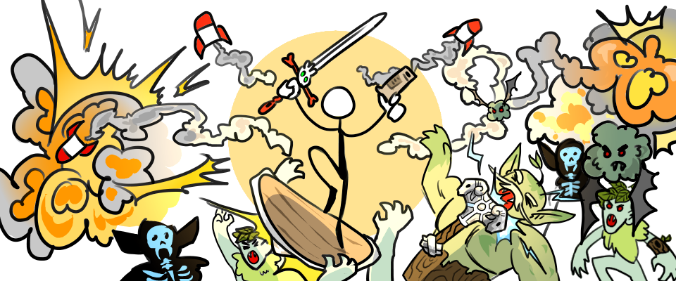

# Green Dusk

Videogame made using Godot Game Engine 4.2 for the Godot Wild Jam 66.
An endless runner meets vampire survivor with a wierd theme about planty daylight vampires. Escape with your life till dusk.

## Gameplay

Press SPACE to jump and pick carefully your build at levelling up.
Survive hordes of enemies with avoiding pitfalls untill the sun sets.

## Team

**Ricardo Gomez Escalante**

- Main role: Team lead / Lead Programming / Producer / Designer

- https://github.com/ricargoes

- https://ricargoes.itch.io

- ricardogomezescalante@gmail.com 

**Almudena Sánchez Encinas**

- Main role: Artist / Lead Designer

- https://github.com/Almudenarios

- https://almu-sanenc.itch.io/
